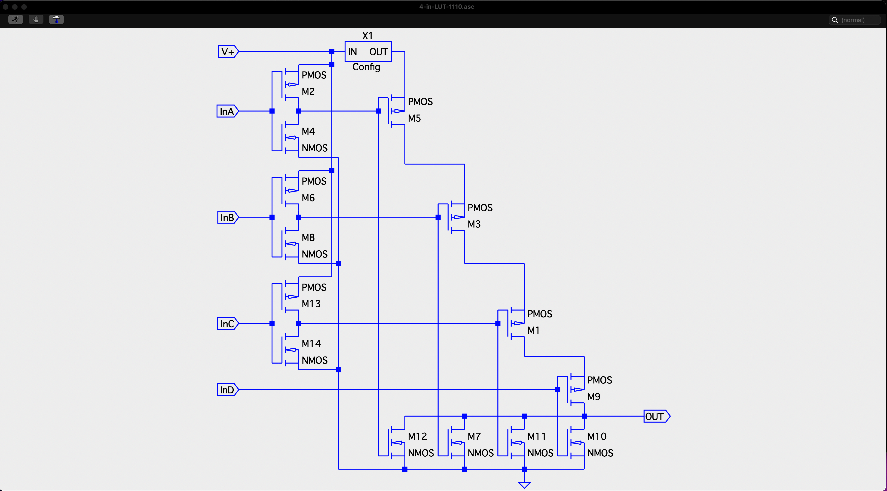
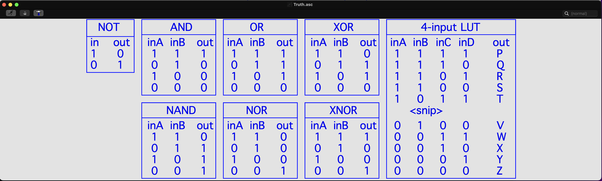
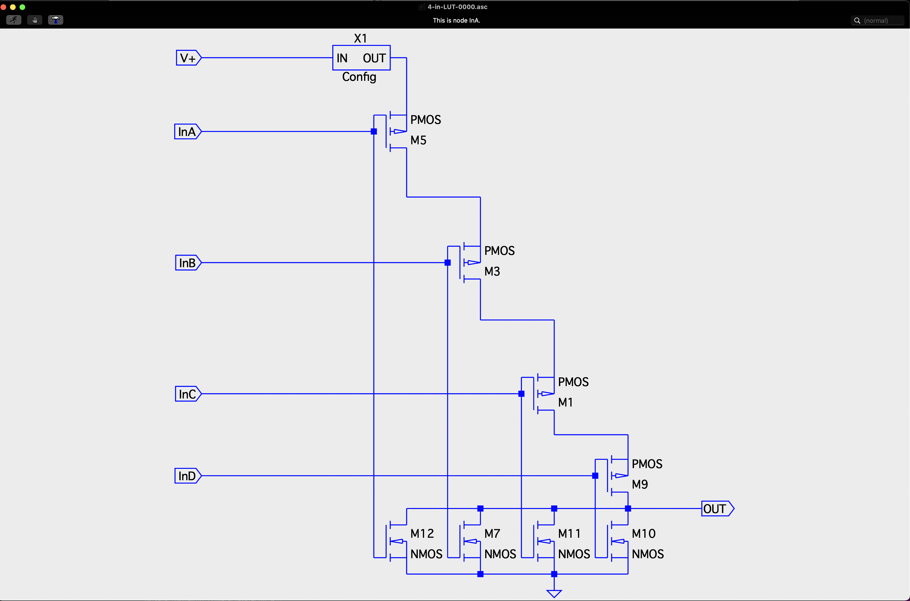

# FPGA-tech-selector-part-2

LTSpice files for simulating a 1 of 8 selector using MOSFET transistors in CMOS pairs.

FPGA Tech: Building a Selector part 2

This time I promise to dig into the details on building a selector inside an FPGA.  If you haven't already seen it, read part 1 of this article first to get the lay of the land, as I will be leaning on it heavily in this article: https://www.linkedin.com/feed/update/urn:li:activity:7270823631310512128/

We now know what a 1 of 8 selector is and how it might look in a discrete IC.  The follow-up question is, how do you build the same selector inside a modern FPGA, which does not already have a hard IP selector?

Internally, an FPGA uses the same basic building blocks repeated thousands or millions of times.  The construction that FPGAs have largely converged on is one with registers--each a single bit of storage--connected to a number of LUTs in series--leading to one or more other registers.  There is also some specialized hard IP built into FPGAs for doing things like Ethernet, PCIe, SRAM,  DSP and others, but often the majority of the code an FPGA dev writes ends up running in registers and LUTs or Look Up Tables.

LUTs are closely related to the tables you were introduced to when you learned about basic digital sub-circuits like NOT, AND, OR and XOR.  They are the tables that describe, given the state of the inputs, what output bit is looked up or retrieved while running.

To create NOT in a LUT, you need a 1-input LUT (all of the LUTs I am going to discuss have a single output).  To create AND, OR, XOR and their negative equivalents--NAND, NOR, XNOR--you need 2-input LUTs.  For combinations of these circuits you need additional inputs, up to the capability of the FPGA (which well may have 6-input LUTs).  

To recreate the discrete selector in the FPGA we are going to limit ourselves to 4-input LUTs.  The output is listed as a letter in the table because your code will determine the lookup result, and therefore output, of each combination of inputs.  Importantly, the resulting sub-circuit does not have to follow any of named combinations like AND or XNOR, but can be anything that is useful and defined before the FPGA is running.

It will probably surprise no one that a 4-input LUT that is active when its inputs are 0000, looks a lot like the address 000 NAND for the discrete selector.  There are other ways to build a LUT out of CMOS logic, but this one is usable and it is similar to the discrete IC in part 1 of this article.  The difference between the two is that the FPGA version has an additional sub-circuit called config.  We are not going to go into the details of how config is configured and runs, but just consider it a single bit of 1 or 0 that is set before the FPGA starts running.  Then, if the Config bit is 1, anytime the IN ports of this part of the LUT are 0000, the OUT port is 1, and anytime the inputs are anything else, the OUT port is 0.

The full 4-input LUT has a total of 16 of these sub-circuits, one at each 4-bit address.  However, a LUT is a configurable part, so you do not have to use all 16 sub-circuits.  In this case, for our selector, 8 will suit us quite nicely.  The key insight is when you realize that all you need to do is specify when the OUT port will be 1 and all of the other LUT circuitry at other addresses will be idle with their OUT ports 0, regardless of what is in the Config bit.  This lets you specify what the OUT port is when the input being addressed or selected is 1, and the idle state of the circuitry will take care of putting a 0 on the OUT port when the input is 0.

Back in the discrete selector from part 1 of this article, in each sub-circuit, the IN port was an inverting pass-through for the frequency being selected.  But in these LUT sub-circuits, the InD port makes the lookup active, or not, depending on the state of the input signal.  This is only a slight difference in how the sub-circuits operate.  The biggest difference between the two circuits is that the discrete selector is hard wired and cannot be changed, but the FPGA LUT, can be configured not only for different width selectors and LUTs, it can be configured for any circuit you like.  There is one more difference to see in the complete FPGA LUT selector circuit.

While the complete circuit is largely the same, the difference is the additional output stage condensing 8 outputs into 1.  For the FPGA we limited our design to using a 4-input LUT, where the discrete circuit we designed in an 8-input NAND that is unavailable in the FPGA.  In the FPGA version, 8 outputs become 2 and 2 outputs become 1.  But the circuit operates the same for both the discrete and FPGA versions.

While the FPGA version employs an extra stage of LUTs to complete its task, it also has the flexibility to be reconfigured as any simple logic circuit, which is flexibility the discrete version does not have.

While few people will ever try to build a selector in an FPGA by manually configuring 4-input LUTs, it is still useful to understand how the design is completed in a FPGA.  The normal way for an FPGA Dev to approach this problem is to use an HDL language like SystemVerilog, in which case the selector would look something like this (leaving out the stimulator):

This is definitely simpler than transistor version of the selector, but it does not necessarily provide you with the insight that going back to basic CMOS logic has hopefully done.

The source code is again available in a GitHub repo I created: https://github.com/dwisehart/FPGA-tech-selector-part-2

If there are other subjects you would like me to cover under the topic of FPGA Tech, please let me know.

